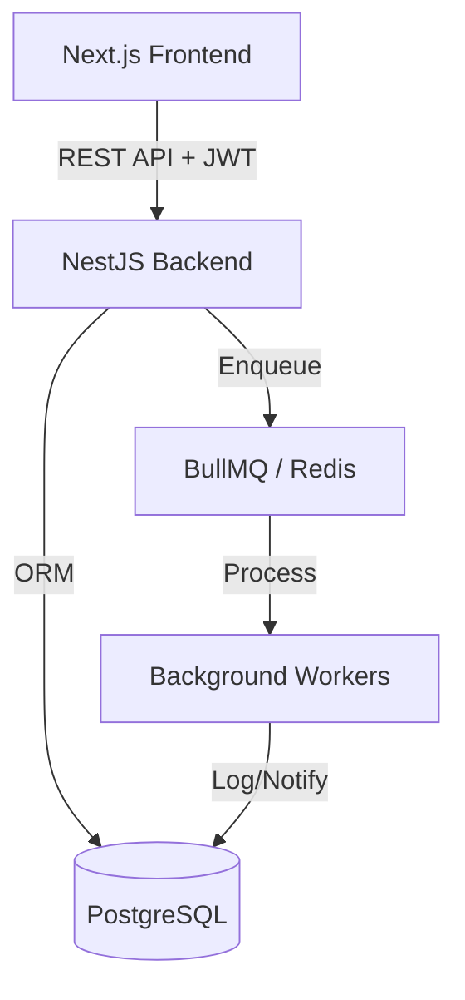

# TaskFlow — Task Management System

A full-stack task management application built with **NestJS**, **Next.js**, **PostgreSQL**, **Redis**, and **BullMQ**.

## Tech Stack

| Layer | Technology |
|-------|-----------|
| Backend | NestJS (TypeScript) |
| Frontend | Next.js 16 + React 19 |
| ORM | Sequelize (sequelize-typescript) |
| Database | PostgreSQL 16 |
| Cache / Queue | Redis 7 + BullMQ |
| Auth | JWT (Passport) |
| State Mgmt | Redux Toolkit (RTK) |
| Styling | Tailwind CSS |

---

## Setup

### Prerequisites

- Node.js ≥ 20
- Docker & Docker Compose

### Option 1: Docker Compose (Quickest)

#### Development Mode
Starts all services with hot-reloading enabled for both backend and frontend.

```bash
docker compose -f docker-compose.yml -f docker-compose.dev.yml up --build
```

- **Frontend**: [http://localhost:3000](http://localhost:3000)
- **Backend API**: [http://localhost:3001/api](http://localhost:3001/api)
- **PostgreSQL**: `localhost:5433`
- **Redis**: `localhost:6379`

#### Production Mode
Starts optimized production builds for backend and frontend.

```bash
docker compose -f docker-compose.yml -f docker-compose.prod.yml up --build
```

---

### Option 2: Manual Setup (Local Development)

#### 1. Start Infrastructure
Start only the database and cache using Docker.

```bash
docker compose up -d postgres redis
```

#### 2. Backend
```bash
cd backend
cp .env.example .env        # Adjust values if needed
npm install
npm run seed                 # Seeds default user
npm run start:dev            # Starts on http://localhost:3001
```

#### 3. Frontend
```bash
cd frontend
npm install
npm run dev                  # Starts on http://localhost:3000
```

---

### Default Login
| Field | Value |
|-------|-------|
| Email | `admin@taskmanager.local` |
| Password | `password123` |

---

## Architecture



### Components
- **Backend**: NestJS application providing a RESTful API. It handles authentication, business logic, and database interactions.
- **Frontend**: Next.js 15 application using the App Router. It provides a responsive UI for managing projects and tasks.
- **Database**: PostgreSQL 16 managed via Sequelize ORM.
- **Asynchronous Processing**: BullMQ with Redis backend for handling non-blocking tasks like activity logging and notifications.

---

## Database Schema

### Design Decisions
- **UUIDs**: Used as primary keys for all tables to ensure security (non-predictable IDs) and easier data merging in distributed environments.
- **Status ENUM**: Strict `TODO`, `IN_PROGRESS`, `DONE` states enforced at the database level.
- **Activity Logs**: Designed to capture system state changes. `taskId` is stored as a plain UUID rather than a hard Foreign Key to allow logs to persist even if a task is permanently deleted (soft-link).
- **Sequelize Synchronize**: Enabled for development speed; however, a migration-based approach is recommended for production environments.

---

## Caching Strategy

Redis is utilized in a dual capacity:
1. **Queue Transport**: The primary role is acting as the message broker for BullMQ. This ensures job persistence and reliable asynchronous processing.
2. **Extensible Cache**: The infrastructure is ready to implement response caching for heavy read operations (e.g., project dashboards) and API rate limiting.

---

## Queue Handling

The system employs a Producer-Consumer pattern using BullMQ:

- **Producers**: Integrated into the Task service. When a task is created or updated, a job is immediately dispatched to Redis.
- **Consumers**: Separate workers (running within the NestJS process) that handle:
    - `task-notification`: Simulates sending notifications.
    - `activity-log`: Persists events to the database.
- **Reliability**: Jobs are automatically retried on failure with exponential backoff configurations.

---

## Assumptions

1. **Environment**: Assumes a Unix-like environment or WSL2 for running Docker and shell commands.
2. **User Scope**: Projects and tasks are currently scoped to the authenticated user (single-tenant logic).
3. **Database State**: Assumes the database is seeded using the provided `npm run seed` command for the initial login.

---

## Trade-offs

| Decision | Trade-off |
|----------|-----------|
| **JWT in LocalStorage** | Improved DX and simplicity vs. potential XSS risk (Mitigated by short expiry). |
| **In-process Workers** | Simplified deployment (one less service) vs. resource contention with the main API. |
| **Soft-link logs** | Data durability for historical logs vs. potential for orphaned data references. |
| **Sequelize Synchronize** | High velocity during development vs. less control over production DDL operations. |
